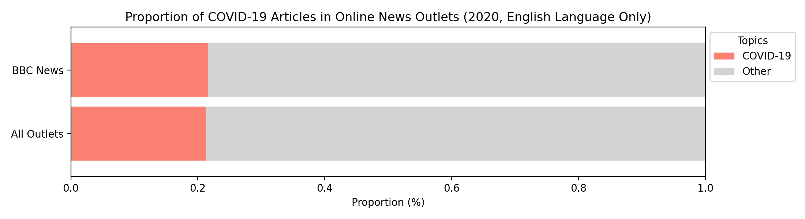
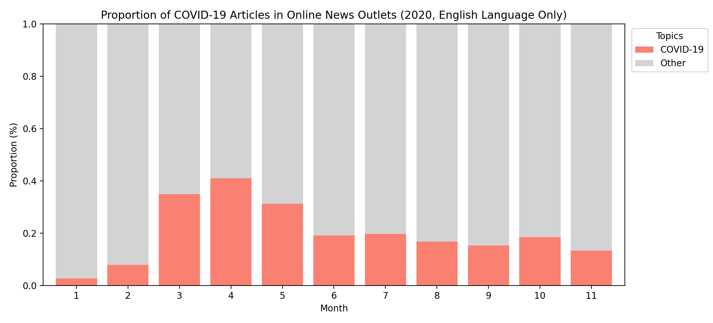
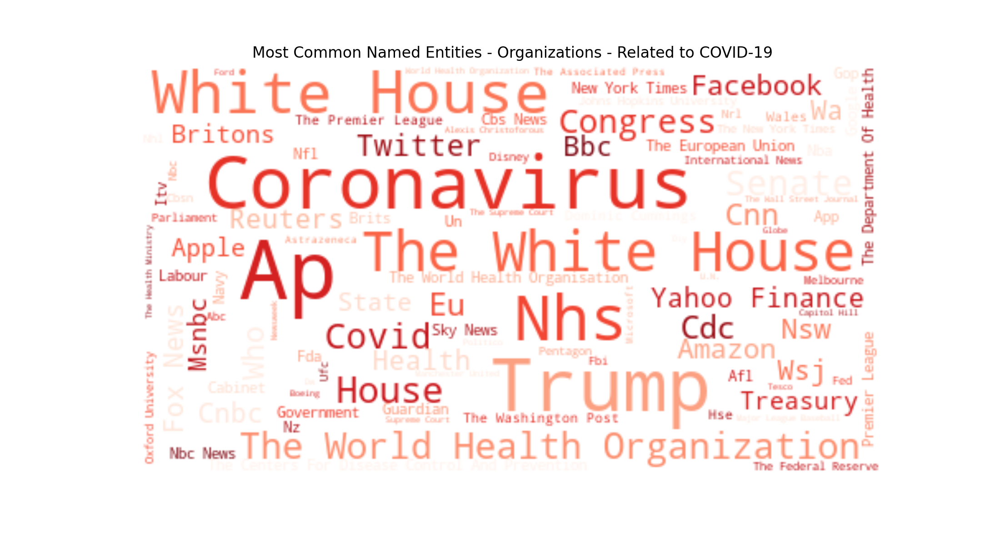

# Text Mining. News Articles Data

This repository contains the following sections:
1. [Implementation of Naive Bayes Classifier for Text Classification from Scratch](#1-implementation-of-naive-bayes-classifier-for-text-classification-from-scratch)
2. [Analysis of COVID-19 Related News Article Proportions](#2-analysis-of-covid-19-related-news-article-proportions)
3. [Named Entitity Recognition](#3-named-entitity-recognition-ner)

## Dataset retrieval

Textual news article data is already gathered beforehand. The dataset is available for everyone and is described under the following links:
- Website for news article data : <http://sciride.org/news.html>
- The processed articles are available here (~16 GB, download completed in May 2021): [Articles Dataset](https://news-mine.s3.eu-west-2.amazonaws.com/processed.tar.gz)
- The relevant data documentation here: <http://sciride.org/news.html#datacontent>

However, in order to use this dataset for other text mining tasks, the data and article information must be extracted from subfolders stored as .gzip files.
The extraction process is described in the file [Text mining - News Articles.ipynb](./Text%20mining%20-%20News%20Articles.ipynb) and already includes several usefull functions.

Dataset preparation includes the following tasks: 
1. Filtering articles by news outlet domain name, language and dates
2. Tagging COVID-19 articles using Regular expressions
3. Prepraring training and test data splits

## 1. Implementation of Naive Bayes Classifier for Text Classification from Scratch

The classifier is implemented as a Python class object called **TextNaiveBayes**, see the file [textnb.py](./textnb.py).
If one decides to download the file [textnb.py](./textnb.py) and store it the respective code folder, one can import import it as follows:

    from textnb import TextNaiveBayes

The TextNaiveBayes class has the following text processing pipeline:
1. Tokenization of the data (from text to sentences to words), removing punctuation and English stopwords
2. Normalization of the tokenized text via stemming (or lemmatization)
3. Creating a vocabulary of distinct word tokens
4. Counting word tokens in each class (i.e. binary classes like 'is_covid' and 'not_covid')
5. Fitting the training data (text)
6. Predicting labels on the test data (text)
7. Estimating the performance of the classifier using accuracy score metric

>### Model Training Summary
>- TextNaiveBayes classifier was used to recognize COVID-19 related texts
>- The model was trained on 80% of data (~8.3 million news article description texts)
>- Text Naive Bayes classifier achieved **96%** accuracy on the remaining 20% of data (~0.9 million news article description texts)

One can download the pre-trained model file [Covid19_Text_Classifier](./Covid19_Text_Classifier)(~10.6 MB) and use it to predict on list of texts:

	import pickle

	# Load the model from disk
	loaded_model = pickle.load(open('Covid19_Text_Classifier', 'rb'))

	# Predict if text is COVID-19 related or not
	y_predicted = loaded_model.predict(X_test)
	print(y_predicted)

## 2. Analysis of COVID-19 Related News Article Proportions
In this section the previously trained Naive Bayes classifier is used to predict if the news article is related to COVID-19 topic.
In this project only online news outlets with English language are analysed (see other available languages in [available_outlets.json](./available_outlets.json) file). Also model is trained only on the article data from 2019 and 2020.

The figure below shows the proportions of all articles published in 2020 compared to BBC News outlet.

It can be seen that BBC News has almost the same proportions with ~21% of articles related to COVID-19.

The figure below shows the monthly proportions of all articles. Data from December month is not complete and is excluded.

It can be seen that it took some time (January, February) before the new coronavirus reached higher interest (March, April, May) and response was taken more seriously. Especially, the observed a lag must be considered taking into account that the first news about a novel coronavirus started to circulate in late December of 2019.
This timeline developemnt coincides with the World Health Organization's (WHO) announcement on 11 March 2020 when WHO labelled the coronavirus outbreak a pandemic.

>### Analysis Summary
>- Average proportion of English Online News Outlets articles related to COVID-19 in 2020 is **~21%**
>- Highest monthly proportion **~41%** was reached in April 2020 after WHO labeled coronavirus outbreak a pandemic on 11 March 2020.

## 3. Named Entitity Recognition (NER)
In this section the most commonly mentioned Named Entities with respect to COVID-19 are extracted using the statistical model from [spaCy](https://spacy.io/) library.
spaCy can recognize various types of named entities (like people, places, organizations etc.) in a text (document), by asking the pretrained models for a prediction. Because models are statistical and strongly depend on the examples they were trained on, they must be tuned for special applications. 
For example, 'en_core_web_sm' - that wass used in this analysis - is a small spaCy English pipeline that is trained on written web text (blogs, news, comments). It first must be downloaded:

	python -m spacy download en_core_web_sm

Loading pretrained statistical model to use it for Named Entitity Recognition:

	import spacy
	nlp = spacy.load("en_core_web_sm")

Named Entities are gathered only from articles related to COVID-19 topic that is classified by previously trained Naive Bayes classifier.
The numeric entitities like quantities, dates, time, percent, ordinal and cardinal entities are removed from the entity list produced by spaCy statisstical model. 
Immediate issues can be detected that the country names like 'US', 'U.S.' and 'United States' are categorized as separate entities, however they shall be merged together. This is done when accounting for the most common entities in the summary part.
In the figure below the most common Named Entities (100 words) are shown. 
 

In the figure below the most common persons are shown. 

In the figure below the most common organizations are shown. It can be seen that 'Trump', 'Covid' and 'Coronavirus' also have been categorised as organizations.

>### NER Summary
>- Most common named from all entities related to COVID-19 topic are US, UK, China, Donald Trump, Coronavirus et al.
>- Most common persons are Donald Trump, Boris Johnson, Joe Biden, Andrew Cuomo, Anthony Fauci et al.
>- Most common organizations are NHS, White House, The World Health Organization, Covid et al.