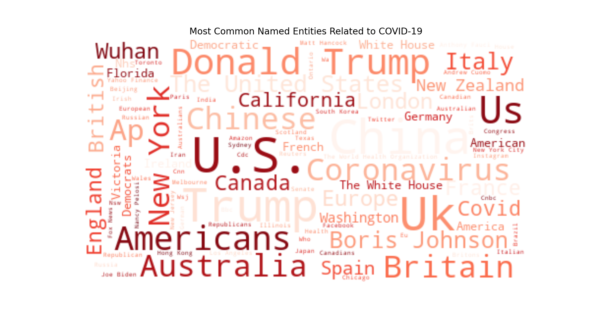

# Text Mining. News Articles Data

This repository contains the following sections:
1. Implementing Naive Bayes Classifier for Text Classification from Scratch
2. Analysis of COVID-19 Related News Article Proportions
3. Named Entitity Recognition

## Dataset retrieval
- News Article data is described here: <http://sciride.org/news.html>
- The processed articles are available here (~16 GB, download completed in May 2021): [Articles Dataset](https://news-mine.s3.eu-west-2.amazonaws.com/processed.tar.gz)
- With the relevant documentation here: <http://sciride.org/news.html#datacontent>

## 1. Implementing Naive Bayes Classifier for Text Classification from Scratch

The classifier is implemented as a Python class object called **TextNaiveBayes**, see the file [textnb.py](./textnb.py).
If you download the file [textnb.py](./textnb.py) in your code, you can 
    from textnb import TextNaiveBayes

The TextNaiveBayes class has the following text processing pipeline:
1. Tokenization of the data (from text to sentences to words), removing punctuation and English stopwords
2. Normalization of the tokenized text via stemming (or lemmatization)
3. Creating a vocabulary of distinct word tokens
4. Counting word tokens in each class (is_covid, not_covid)
5. Fitting the training data
6. Predicting labels on the test data
7. Estimating the performance of the classifier using accuracy score metric

>### Model training results
>- TextNaiveBayes classifier was used to recognize COVID-19 related texts
>- The model was trained on 80% of data (~8.3 million news article description texts)
>- Text Naive Bayes classifier achieved **96%** accuracy on the remaining 20% of data (~0.9 million news article description texts)

Download pre-trained model file [Covid19_Text_Classifier](./Covid19_Text_Classifier)(~10.6 MB) and predict on your list of texts:

	import pickle

	# Load the model from disk
	loaded_model = pickle.load(open('Covid19_Text_Classifier', 'rb'))

	# Predict if text is COVID-19 related
	y_predicted = loaded_model.predict(X_test)
	print(y_predicted)

## 2. Analysis of COVID-19 Related News Article Proportions
In this section the previously trained Naive Bayes classifier is used to predict if the news article is related to COVID-19 topic.

The figure below shows the proportions of all articles published in 2020 compared to BBC News outlet.

It can be seen that BBC News has almost the same proportions with ~21% of articles related to COVID-19.

The figure below shows the monthly proportions of articles. Data from December month is not complete.

## 3. Named Entitity Recognition
In this section the most commonly mentioned Named Entities with respect to COVID-19 are extracted using the statistical model from [spaCy](https://spacy.io/) library.
spaCy can recognize various types of named entities in a document, by asking the model for a prediction. 
Because models are statistical and strongly depend on the examples they were trained on, this doesn’t always work perfectly and might need some tuning later, depending on your use case.
In the figure below the most common Named Entities (100 words) are shown.
 
